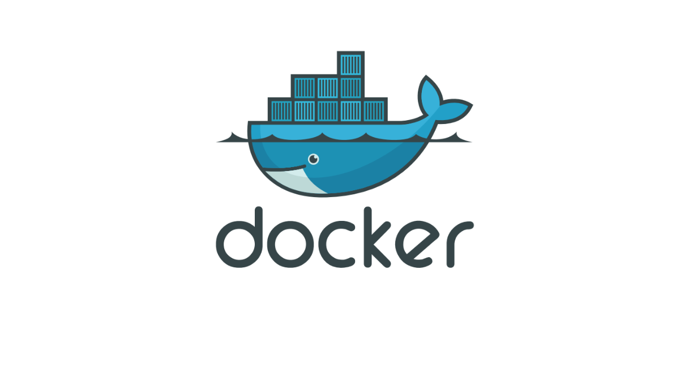
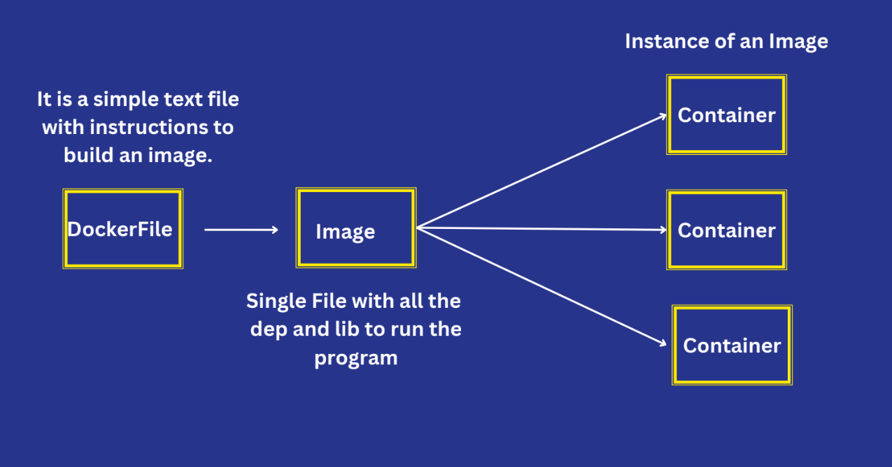
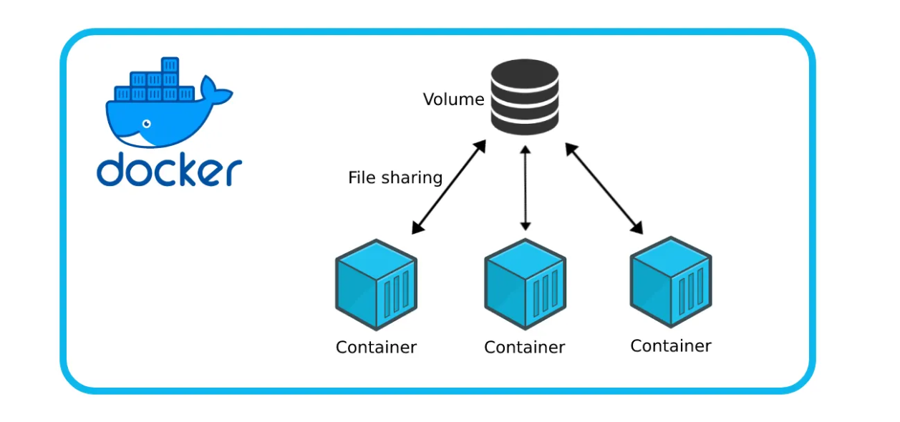

# Docker Notes

## What is Docker?
Docker is a **containerization platform** for developing, packaging, shipping, and running applications.  

- Provides the ability to run an application in an isolated environment called a **container**.  
- Makes deployment and development efficient.  
- Solves the problem of *"Why is it working on my machine and not yours?"* by ensuring consistent environments across systems.

---

## What is a Container?
A **container** is a lightweight, standalone, and executable software package that includes:  
- Application code  
- Runtime environment  
- System tools and libraries  
- Configuration files  

Containers share the **host operating system kernel** but remain isolated from each other.  
This makes them faster and more efficient than virtual machines.

---

## What is the Docker Engine?
The **Docker Engine** is the client-server application that builds and runs containers.

- **Server (Daemon):** A background process (`dockerd`) that manages Docker objects (images, containers, networks, volumes).  
- **REST API:** Allows programs to communicate with the daemon.  
- **CLI (Command Line Interface):** The `docker` command that interacts with the Docker daemon.

### How Docker Works on OS & Hardware
- Docker uses the host **OS kernel** features (namespaces, cgroups, union file systems) to run containers.  
- Unlike virtual machines, Docker **does not virtualize hardware** — it runs directly on the OS kernel.  
- This makes containers lightweight, fast to start, and efficient in resource usage.

---

## Docker Objects

### 1. Dockerfile
A **Dockerfile** is a text document that contains instructions to build a Docker image.  

🔗 [Official Dockerfile Reference](https://docs.docker.com/reference/dockerfile/)

Example:
```dockerfile
# Use an official Node.js image
FROM node:18

# Set working directory
WORKDIR /app

# Copy files
COPY . .

# Install dependencies
RUN npm install

# Run the app
CMD ["node", "server.js"]
```

### 2. Docker Image
A **Docker image** is a read-only template used to create containers.  

- Built from instructions in a Dockerfile.  
- Can be shared via **Docker Hub** or private registries.  
- Images are **immutable** (cannot be changed once built).  

---

### 3. Docker Container
A **container** is a running instance of an image.  

- You can run, stop, move, and delete containers.  
- Containers are **ephemeral** — you can destroy them and recreate new ones from the same image.  

🔑 **Relationship:**  

- **Dockerfile** → Defines how to build an **Image**.  
- **Image** → Template for running a container.  
- **Container** → An instance of an image, running in isolation.  

---

## Docker Commands & Concepts

### Build & Manage Images
- Create an image from a Dockerfile:
  ```bash
  docker build .
  ```

- Create an image with a tag:
  ```bash
  docker build -t mywebapp:01 .
  ```

- List images:
  ```bash
  docker image ls
  ```

- Remove an image:
  ```bash
  docker rmi <image_id>
  ```

- Rename an image:
  ```bash
  docker tag old_image_name:tag new_image_name:tag
  ```

### Run & Manage Containers
- Run a container from an image:
  ```bash
  docker run <image_id>
  ```

- Run a container with a custom name (auto-remove on stop):
  ```bash
  docker run -d --rm --name "container_name" -p 3001:3000 <image_id>
  ```

- List running containers:
  ```bash
  docker ps
  ```

- Stop a container:
  ```bash
  docker stop <container_name>
  ```

- Remove containers:
  ```bash
  docker rm <container_name1> <container_name2>
  ```

### Ports & Networking
- Expose container port to host:
  ```bash
  docker run -p 3000:5000 <container_id>
  ```
  - **HOST_PORT** (outside on machine/VM): `3000`
  - **CONTAINER_PORT** (inside container): `5000`

- Run in detached mode:
  ```bash
  docker run -d -p 3000:5000 <container_id>
  ```

- You can run multiple containers from the same image by mapping to different host ports.
- (This behaves like basic load balancing, but real load balancing requires additional tools.)

### Updating Images
- Images are **immutable** → You cannot modify an image directly.
- If the project code changes → build a new image and run containers from it.

### Docker Hub
- Find/pull official images: [Docker Hub](https://hub.docker.com/)
- Example:
  ```bash
  docker pull python:3.9.23-trixie
  ```

- Push your own image:
  1. Create a repo on Docker Hub (same name as local).
  2. Login:
     ```bash
     docker login
     ```
  3. Tag & push:
     ```bash
     docker tag local_name:tag acc_name/repo_name:tag
     docker push acc_name/repo_name:tag
     ```

### Interactive Mode
- Run a container in interactive mode (`-it`) for user input:
  ```bash
  docker run -it <container_id_or_name>
  ```

---

## Docker Volumes & Data Persistence



### Why Do We Need Volumes?

**Normal Use Case:**
A Python program which writes and reads from external files. When the container is removed, that file will also be removed. So we need volumes to persist data.

**Real Life Use Case:**

1. **Application Logs**
   - Imagine a Node.js app running in Docker that writes logs to `/app/logs`.
   - **Without a volume:** logs disappear when the container is removed.
   - **With a volume:**
     ```bash
     docker run -d -v app_logs:/app/logs my-node-app
     ```
     Logs are persisted on the host, so you can analyze/debug them later.

2. **Shared Data Between Containers**
   - Say you have:
     - **Container A:** An app that **uploads files** to `/app/uploads`.
     - **Container B:** An Nginx server that **serves those files**.
   - If both containers mount the same volume:
     ```bash
     docker run -v shared_data:/app/uploads app
     docker run -v shared_data:/usr/share/nginx/html nginx
     ```
   → Both containers see the same files.
   
   👉 **Real-world:** Used in microservices when different services need access to the same data.

### Docker Volume Commands

**Create a volume:**
```bash
docker volume create volume_name
```

**Complete command to use volume:**
```bash
docker run -v volume_name:container_directory image_name
```

**Example:**
```bash
# Create a volume
docker volume create my_data

# Run container with volume mounted
docker run -d -v my_data:/app/data python:3.9
```

**Check all volume commands:**
```bash
docker volume --help
```

### Mount Bind in Docker

**Use Case:** If any program is using external files to process, then we need to bind that file with Docker. For instance, any Python program uses external system files to read data.

This is generally used for the local system.

**Mount Bind Command:**
```bash
docker run -v /host/file/path:/container/file/path image_name
```

**Example:**
```bash
# Bind mount a local directory to container
docker run -v /home/user/data:/app/data python:3.9

# Bind mount a specific file
docker run -v /home/user/config.json:/app/config.json my-app
```

This is how we can mount bind: `host_file_path:container_file_path`

---

## What is .dockerignore?

The `.dockerignore` file tells Docker which files and directories to **exclude** when building an image. It works similar to `.gitignore` for Git.

### Why Use .dockerignore?
- **Faster builds:** Excludes unnecessary files from build context
- **Smaller images:** Prevents unwanted files from being copied into the image
- **Security:** Keeps sensitive files (like `.env`, private keys) out of images
- **Cleaner builds:** Excludes temporary files, logs, and development artifacts

### Common .dockerignore Patterns:
```dockerignore
# Dependencies
node_modules/
__pycache__/
*.pyc

# Version control
.git/
.gitignore

# Environment files
.env
.env.local

# Logs and temporary files
*.log
tmp/
temp/

# Documentation
README.md
docs/

# Development tools
.vscode/
.idea/

# Build artifacts
dist/
build/

# OS generated files
.DS_Store
Thumbs.db
```

### Example Usage:
1. Create `.dockerignore` in the same directory as your `Dockerfile`
2. Add patterns for files/folders to exclude
3. When you run `docker build .`, Docker will ignore these files

**Benefits:**
- Build context becomes smaller and faster
- Your final image doesn't contain unnecessary development files
- Sensitive configuration files stay on your local machine

---

## Docker Networking


### Problem Statement

When you have multiple containers that need to communicate with each other, such as:
- **API Container** → **Database Container**
- **Web Server** → **Backend Service**
- **Microservices** communicating with each other

**The Challenge:**
Without proper networking, containers are isolated. To connect an API container to a DB container, you would need to:

1. **Find the DB container's IP address:**
   ```bash
   docker inspect container_name
   ```
   
2. **Look for the IP address** in the network object from the inspect output

3. **Hardcode this IP** in your API code's database connection string:
   ```javascript
   // Not ideal - IP can change when container restarts
   const dbHost = "172.17.0.3"; // Found from docker inspect
   ```

**Problems with this approach:**
- IP addresses change when containers restart
- Hard to manage and maintain
- Not scalable for multiple environments
- Requires manual inspection and updates

### Solution: Docker Networks

Docker networks allow containers to communicate using **container names** instead of IP addresses, making connections more reliable and easier to manage.

### Docker Network Commands

**Get help with network commands:**
```bash
docker network --help
```

**Create a custom network:**
```bash
docker network create my-network
```

**List all networks:**
```bash
docker network ls
```

**Inspect a network:**
```bash
docker network inspect my-network
```

**Remove a network:**
```bash
docker network rm my-network
```

### Using Docker Networks

**Connect containers to a network:**
```bash
# Run containers with custom network
docker run -d --network my-network --name api-container my-api-image
docker run -d --network my-network --name db-container postgres:13
```

**Connect existing container to network:**
```bash
docker network connect my-network existing-container
```

### Practical Example

**Without Docker Network (Manual IP):**
```javascript
// In your API code - BAD approach
const dbConnection = {
  host: '172.17.0.3', // Hard-coded IP from docker inspect
  port: 5432,
  database: 'myapp'
};
```

**With Docker Network (Container Names):**
```javascript
// In your API code - GOOD approach
const dbConnection = {
  host: 'db-container', // Use container name directly!
  port: 5432,
  database: 'myapp'
};
```

**Step-by-step workflow:**
1. **Create a network:**
   ```bash
   docker network create app-network
   ```

2. **Run database container:**
   ```bash
   docker run -d --network app-network --name db-container \
     -e POSTGRES_PASSWORD=password postgres:13
   ```

3. **Run API container:**
   ```bash
   docker run -d --network app-network --name api-container \
     -p 3000:3000 my-api-image
   ```

4. **In your API code,** use `db-container` as the hostname instead of an IP address.

### Benefits of Docker Networks
- **Service Discovery:** Containers can find each other by name
- **Dynamic IP Management:** No need to hardcode IP addresses  
- **Isolation:** Different networks keep container groups separate
- **Scalability:** Easy to add/remove containers from networks
- **Environment Consistency:** Same setup works across dev/staging/production

### Network Types
- **bridge** (default): Containers on same host can communicate
- **host**: Container uses host's network directly
- **none**: No networking
- **Custom bridge**: User-defined networks with better isolation and features

---

## Docker Compose

### What is Docker Compose?

Docker Compose is a **configuration file based on YAML** to manage multiple containers as a single application stack. Instead of running multiple `docker run` commands with various flags, you define everything in a single `docker-compose.yml` file.

### Understanding YAML in Docker Context

**YAML Reality Check:**
YAML feels like "just some indentation magic" at first, but there's a deeper logic behind it.

**Why YAML Everywhere?**
- **YAML (YAML Ain't Markup Language)** is just a **data format** (like JSON, but easier for humans to read/write)
- Tools like **Docker Compose, GitHub Actions, GitLab CI/CD, Kubernetes, Ansible, etc.** all use YAML because it's:
  - Human-friendly
  - Supports nesting (good for complex configs)  
  - Easy to parse for machines

So YAML itself doesn't "do" anything. It's just structured text. 👉 The **meanings of the keywords** (`services`, `build`, `jobs`, `steps`, etc.) come from the **tool** reading the YAML.

**Example - Docker Compose:**
```yaml
version: "3"
services:
  web:
    build: .
    ports:
      - "8080:80"
  db:
    image: postgres:13
    volumes:
      - db_data:/var/lib/postgresql/data
volumes:
  db_data:
```

Here `services`, `build`, `ports`, `volumes` are **Docker Compose keywords** defined in its specification.

🔗 [Official Docker Compose File Reference](https://docs.docker.com/compose/compose-file/)

### Docker Compose Basics

Docker Compose is basically defining and writing everything we were doing with commands:
- Container management
- Environment variables  
- Networks
- Volumes
- Dependencies
- All that stuff in one YAML file

### Single Container Example

```yaml
services:
  mysqldb:
    image: 'mysql:latest'
    environment:
      - MYSQL_ROOT_PASSWORD=root
      - MYSQL_DATABASE=userinfo
    container_name: "mysqldb"
```

**Run the compose:**
```bash
# Start containers
docker-compose up

# Start in detached mode
docker-compose up -d
```

### Multi-Container Example

```yaml
services:
  mysqldb:
    image: 'mysql:latest'
    environment:
      - MYSQL_ROOT_PASSWORD=root
      - MYSQL_DATABASE=userinfo
    container_name: "mysqldb"

  mypythonapp:
    build: ./
    container_name: mypyapp
    depends_on:
      - mysqldb
```

**Problem:** `depends_on` only waits for container to **start**, not for the service inside to be **ready**.

### Adding Health Checks

MySQL takes time to initialize even after the container starts. The API container might try to connect before MySQL is ready.

**Solution:** Use health checks with conditional dependencies.

```yaml
services:
  mysqldb:
    image: 'mysql:latest'
    environment:
      - MYSQL_ROOT_PASSWORD=root
      - MYSQL_DATABASE=userinfo
    container_name: "mysqldb"
    networks:
      - my-network
    healthcheck:
      test: ['CMD', 'mysqladmin', 'ping', '-h', 'localhost']
      timeout: 20s
      retries: 10

  mypythonapp:
    build: ./
    container_name: mypyapp
    networks:
      - my-network
    volumes:
      - ./servers.txt:/myapp/servers.txt
    depends_on:
      mysqldb:
        condition: service_healthy
    stdin_open: true    # For interactive mode
    tty: true          # For interactive mode
```

🔗 [Health Check Reference](https://docs.docker.com/reference/compose-file/services/#healthcheck)
🔗 [Depends On Reference](https://docs.docker.com/reference/compose-file/services/#depends_on)

### Complete Example with Networks and Volumes

```yaml
services:
  mysqldb:
    image: 'mysql:latest'
    environment:
      - MYSQL_ROOT_PASSWORD=root
      - MYSQL_DATABASE=userinfo
    container_name: "mysqldb"
    networks:
      - my-network
    volumes:
      - mysql_data:/var/lib/mysql
    healthcheck:
      test: ['CMD', 'mysqladmin', 'ping', '-h', 'localhost']
      timeout: 20s
      retries: 10

  mypythonapp:
    build: ./
    container_name: mypyapp
    networks:
      - my-network
    volumes:
      - ./servers.txt:/myapp/servers.txt
    depends_on:
      mysqldb:
        condition: service_healthy
    stdin_open: true
    tty: true

networks:
  my-network:

volumes:
  mysql_data:
```

### Docker Compose with Ports

```yaml
services:
  web-api:
    build: ./api
    container_name: web-api
    ports:
      - "3000:3000"    # Host:Container
      - "3001:3001"    # Multiple ports
    networks:
      - app-network

  frontend:
    build: ./frontend
    container_name: frontend
    ports:
      - "80:3000"      # Host port 80 → Container port 3000
    depends_on:
      - web-api
    networks:
      - app-network

  database:
    image: postgres:13
    container_name: database
    environment:
      - POSTGRES_PASSWORD=password
    ports:
      - "5432:5432"    # Expose DB for external tools
    networks:
      - app-network

networks:
  app-network:
```

### Important Docker Compose Commands

**Start services:**
```bash
docker-compose up
docker-compose up -d                    # Detached mode
docker-compose up --build              # Rebuild images
```

**Run individual services:**
```bash
docker-compose up mysqldb              # Start only specific service
docker-compose run mypythonapp bash    # Run one-off command
```

**Stop and cleanup:**
```bash
docker-compose down                     # Stop containers, remove containers and networks
docker-compose down -v                  # Also remove volumes
docker-compose down --rmi all          # Also remove images
```

**Other useful commands:**
```bash
docker-compose ps                       # List running services
docker-compose logs                     # View logs from all services
docker-compose logs mysqldb            # View logs from specific service
docker-compose exec mysqldb bash       # Execute command in running container
```

### Automatic Networking

**Question:** We haven't created any network, then how are both apps connected?

**Answer:** Docker Compose **automatically creates a network** for all services in the compose file. All containers can communicate using their **service names** as hostnames.

**Example:**
- In your Python app, connect to MySQL using hostname: `mysqldb` (the service name)
- No need to find IP addresses or create networks manually

### Key Benefits of Docker Compose

- **Single Command Deployment:** `docker-compose up` starts entire application stack
- **Environment Consistency:** Same setup across development, staging, production  
- **Service Discovery:** Containers communicate by service names
- **Dependency Management:** Control startup order with `depends_on` and health checks
- **Volume & Network Management:** Define everything in one place
- **Easy Scaling:** Scale services with `docker-compose up --scale web=3`