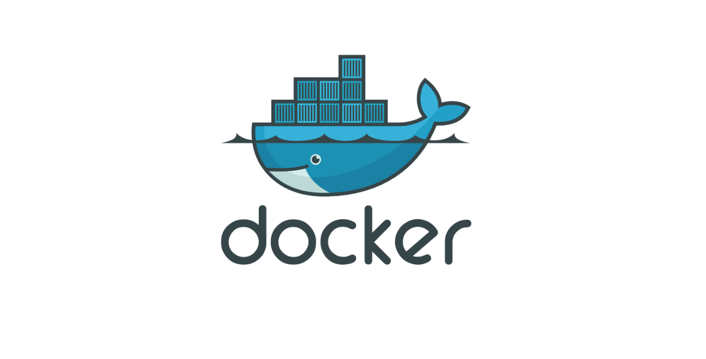

# Docker Notes

## What is Docker?
Docker is a **containerization platform** for developing, packaging, shipping, and running applications.  

- Provides the ability to run an application in an isolated environment called a **container**.  
- Makes deployment and development efficient.  
- Solves the problem of *“Why is it working on my machine and not yours?”* by ensuring consistent environments across systems.

---

## What is a Container?
A **container** is a lightweight, standalone, and executable software package that includes:  
- Application code  
- Runtime environment  
- System tools and libraries  
- Configuration files  

Containers share the **host operating system kernel** but remain isolated from each other.  
This makes them faster and more efficient than virtual machines.

---

## What is the Docker Engine?
The **Docker Engine** is the client-server application that builds and runs containers.

- **Server (Daemon):** A background process (`dockerd`) that manages Docker objects (images, containers, networks, volumes).  
- **REST API:** Allows programs to communicate with the daemon.  
- **CLI (Command Line Interface):** The `docker` command that interacts with the Docker daemon.

### How Docker Works on OS & Hardware
- Docker uses the host **OS kernel** features (namespaces, cgroups, union file systems) to run containers.  
- Unlike virtual machines, Docker **does not virtualize hardware** — it runs directly on the OS kernel.  
- This makes containers lightweight, fast to start, and efficient in resource usage.

---

## Docker Objects

### 1. Dockerfile
A **Dockerfile** is a text document that contains instructions to build a Docker image.  
Example:
```dockerfile
# Use an official Node.js image
FROM node:18

# Set working directory
WORKDIR /app

# Copy files
COPY . .

# Install dependencies
RUN npm install

# Run the app
CMD ["node", "server.js"]
